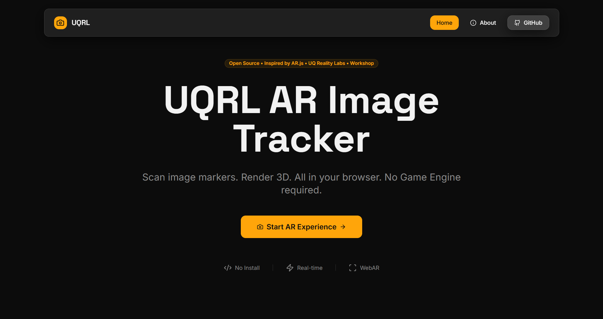
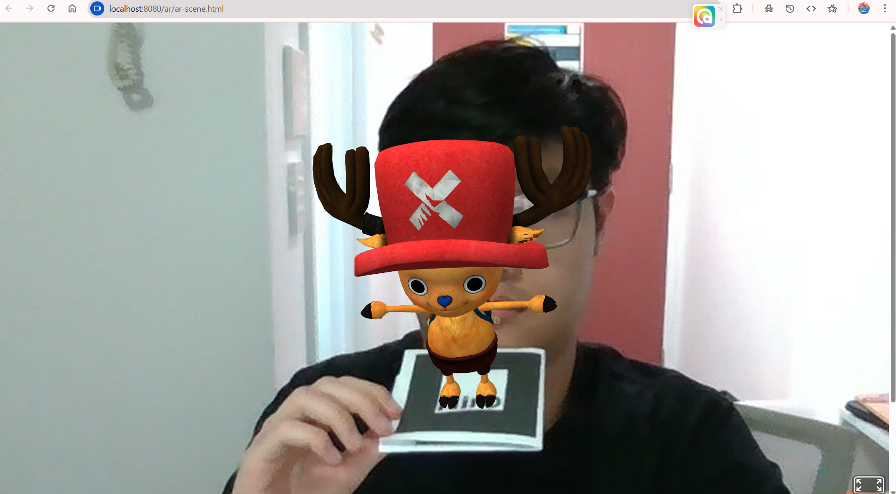

# 🧠 UQRL AR Generation

A practical web-based Augmented Reality (AR) demo created by **UQ Reality Lab (UQRL)** for 
workshops and educational showcases. This project detects Hiro Markers and renders 
3D models in AR using browser-native technologies — without the need for Unity or native apps.

The project is created for workshop: Introduction to VR/AR (Sem 2, 2025). We welcome anyone interest
in our project to use it for their learning material.

The project has provided a simple web-based integration of AR detection. The marker for detection
is a Hiro mark. **You should use a printed Hiro mark. Camera deficiency and environment
lighting will affect marker detection.**

---

## 🚀 Live Demo

👉 [Launch AR Scene](https://justcallmehao.github.io/UQRL_AR_generation/ar/ar-scene.html)
👉 [Preview UQRL Websiteonly](https://justcallmehao.github.io/UQRL_AR_generation)

*Note*: Our GitHub deploy version will have different routing to the local project in this repo.
GitHub deployment may not recognise the link between *Website* vs *AR* but local development works.
We decided to keep it as it is for you to configure it on your own.

All functionalities should be able to work on local hosting or other configuration/hosting.

## 🖼️ Demos & Screenshots

**Main Demos:**






**We also include a Python version running in backend using uvicorn & FastAPI. The folder 'py_backend_ver' is 
separated from the whole project. You can run it from backend manually. 
This folder only serve for learning purposes and those may wish to use minimal functioning code.
The Python demo:**


---

## 📦 Project Structure

```
.
├── public/                 # Static public assets
│   └── ar                  
│       └── ar-scene.html   # Main AR HTML entry point
│   └── static              
│       └── models          
│           └── model.glb   # !REPLACE HERE: any .glb model of your choice
│
├── src/                    # Source code (React/Vite frontend)
│   ├── assets/             
│   ├── components/         
│   ├── main.tsx            
│   └── ...
│
├── dist/                   # Optional: Production-ready output (auto-generated)
│
├── vite.config.ts          # Vite configuration
├── package.json            # Optional based on your local machine
└── ...                     # Other configuration
```

---

## 🧰 Tech Stack

- **Frontend**: Vite + TypeScript + React
- **AR Engine**: [AR.js](https://ar-js-org.github.io/AR.js-Docs/) (Marker-based WebAR)
- **3D Model Format**: `.glb` (GLTF Binary)
- **Rendering**: A-Frame (built into AR.js)
- **Optional Deployment**: GitHub Pages via `gh-pages` branch

---

## 🔍 Features

- 📷 WebAR Hiro Marker detection
- 🧱 Loads `.glb` 3D models on marker detection
- 🪟 Responsive overlay with debug logs and interaction buttons
- ⚙️ Uses AR.js + A-Frame for low-cost AR rendering
- 🌐 Fully browser-compatible (no app install)

---

## 🛠️ Setup Instructions

### 1. Install dependencies

*(Your package-lock.json created here, replace it with the current one in project)*

```bash
npm install
```

### 2. Start development server

```bash
npm run dev
```

*(Ctrl+C to exit local hosting session)*

### 3. Build for production (Optional)

```bash
npm run build
```

### 4. Preview locally (Optional)

```bash
npm run preview
```

---

## 🌍 Deployment (GitHub Pages)

*We provide 2 versions for vite configuration. 
We recommend you use the local development and the have your own
config for any other use. Delete or comment out the right configuration*

```bash
// For local development (Recommend)
export default defineConfig(({ mode }) => ({
  server: {
    host: "::",
    port: 8080,
  },
  plugins: [
    react(),
    mode === 'development' &&
    componentTagger(),
  ].filter(Boolean),
  resolve: {
    alias: {
      "@": path.resolve(__dirname, "./src"),
    },
  },
}));

// For GitHub hosting built
export default defineConfig({
   base: '/UQRL_AR_generation/',
   plugins: [react()],
   resolve: {
     alias: {
       "@": path.resolve(__dirname, "./src"),
     },
   },
})
```
---

## 📚 References

Special thanks to tools/frameworks made from community

- [AR.js Docs](https://ar-js-org.github.io/AR.js-Docs/)
- [A-Frame Docs](https://aframe.io/docs/)
- [GLB Model](https://sketchfab.com/3d-models/tony-chopper-2619979aa9144373bd894685db999bda)

---

## 👥 Credits

This project is developed by **UQ Reality Lab** (UQRL) for introductory workshops in AR and WebXR development.

Special thanks to:
- Hao Vo (@justcallmehao) [Contact](https://www.linkedin.com/in/howlvoreworkingspace/)

---

## 📄 License

MIT License. See `LICENSE` file for more details.
